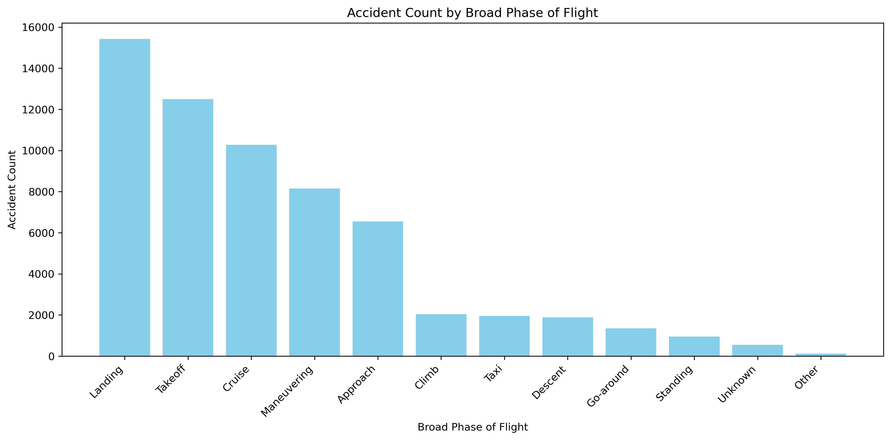
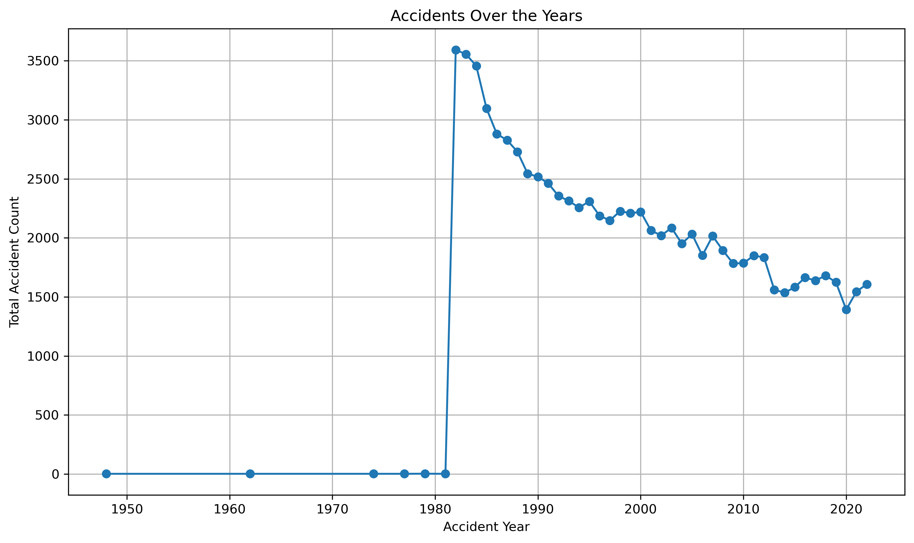

 

# Aviation Enterprise Risk Analysis

**Author:** Nelson Kamau

## Project Overview.

The company is expanding into aviation and needs to identify the lowest-risk aircraft for commercial and private operations. This analysis will assess accident data, survival rates, and key aircraft characteristics to guide data-driven acquisition decisions.

The project will evaluate accident frequency over time and determine which aircraft models have the fewest incidents. Survival rates will be analyzed to assess safety during accidents, with comparisons based on aircraft make, model, engine type, and number of engines. Additional risk factors, such as amateur-built status and aircraft damage levels, will be examined to provide a comprehensive safety profile.

Beyond the aircraft themselves, environmental and operational factors will also be considered. The impact of weather conditions and accident trends during different flight phases will offer deeper insights into potential risks.

## Business Problem
  The company is expanding in to new industries to diversify its portfolio. Specifically, they are interested in purchasing and operating airplanes for commercial and private enterprises, but do not know anything about the potential risks of aircraft. You are charged with determining which aircraft are the lowest risk for the company to start this new business endeavor. You must then translate your findings into actionable insights that the head of the new aviation division can use to help decide which aircraft to purchase.

## Methods

This project uses descriptive analysis, mostly box plots for explatory data analysis. This helps summarize the distribution of the dataset and identify key statistical properties. This provides a useful overview of National Transportation Safety Board dataset.

## Results
1. I was able to extract the top 20 list for planes with high survival rate:

 

2. Identified  Phases of flight with High accident Count:

 

3. Time series plot showed a downward trend in number of accident counts:




## Conclusions
1. A top 20 list of possible planes that have very high survival rates that would offer low risk in the event of any incidents.
2. A metric for Flight Purposes with high accident counts that would offer high risk. This gives the company an opportunity to make a decision on    the specific business/purpose of the aviation venture.
3. Provided with the phases of the flight process that had high accident counts this will allow for operations streamlining. Ensuring that the      phases have proper safety checks and also increased training to ensure incidents do not occur.
4. Analysis also looked into the plane characteristics that appear dominantly in the top 20 list being: Not amateur built, Turbo Fan engine and      one engine. this would offer a good criteria when undergoingthe plane acquisition process.
5. The time series plot shows a downward trend in the number of accidents that occurred. This shows a reduction in the risk factor for plane        accidents and offers great projections as future advancements continue to come up.


## For More Information

See the full analysis in the [Jupyter Notebook](./Aviation_Enterprise_Analysis.ipynb) or review this [presentation](./Aviation_Enterprise_Final.pdf).
For additional info, contact Nelson Kamau Kahiga at [kamaunelson94@gmail.com](kamaunelson94@gmail.com)
View the Interactive Dashboard  
🔗 [Click here to view on Tableau Public](https://public.tableau.com/views/Planesurvivalrates/Dashboard1?:language=en-US&:sid=&:redirect=auth&:display_count=n&:origin=viz_share_link)

## Repository Structure

```
├── data
├── images
├── README.md
├── AAviation_Enterprise_Final.pdf
└── Aviation_Enterprise_Analysis.ipynb
```